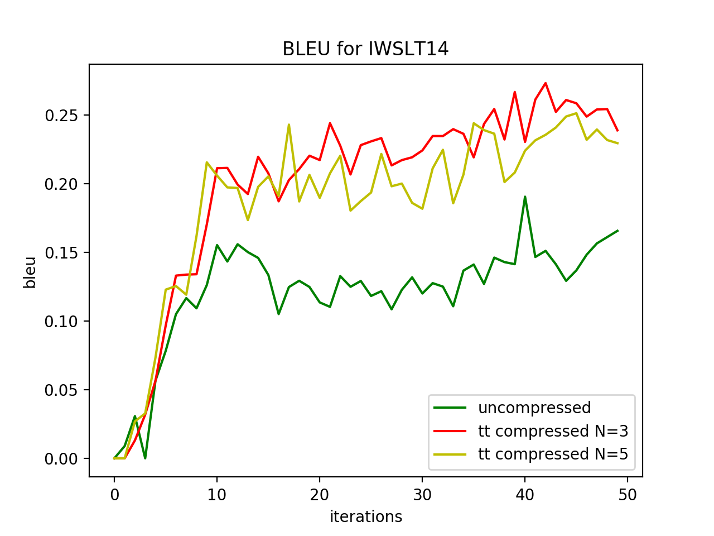
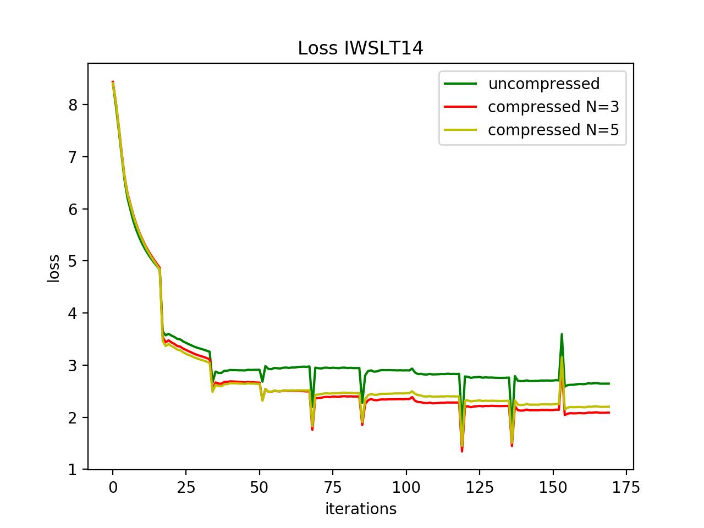

## Results

This file contains primary result of compressed model on wmt16.
Train set contains 29100 pairs of sentences (ge-en).
 
Total numbers of parameters in the model:  64231918

Num of the epoch - 20, batch size - 150
small-transformer model has 3 block-layers instead of 6

| method         | test, bleu  | N_comp/N  | Compress_ratio | Time |
|----------------|---------|---------| -------------- |------|
| original model |  0.442 |  0/6   |  1.0 |  41.38 |
| tt-transformer | 0.407 | 6/6 | 1.644 | 84.56 |
| small-transformer | 0.403 | 0/3 | 1.6 | - |
| tt-small-transformer | 0.396 | 3/3 | 2.1713 | 34.94 |
| tt-transformer | 0.468  | 5/6 |  1.484 |  59.833 |
| tt-transformer | 0.455  | 4/6 | 1.353 | 60.4 |
| tt-transformer | 0.472 | 3/6 |  1.243 | 45.28 |
| tt-transformer | 0.450 | 2/6 | 1.150 | 43.97
| tt-transformer | 0.369 | 1/6 | 1.07 | 34.63

 

We use tt-decomposition for every fc layer in encoder and decoder  in the following way:
- ranks of the first layer   : 2x4x4x2
- ranks of  the second layer : 4x4x4x4
(ones-dimensions have been omitted)

Compression ratio is the ration of #(original parameters) to #(parameters in compressed networks) 

### IWSLT14

It's interesting that network with less parameters can be train in more efficiently.

 | model | bleu-valid | bleu-test | time |
 | ------ | ---- | ---- | ---- |
 | transformer | 0.165 |  0.1363 | 146.16 |
 | compressed 5| 0.212 | 0.197 | 237.97 |
 | compressed 3| 0.212 | 0.192 | 187.35 |
 
 
 *time for inference
 
 
 
 
  